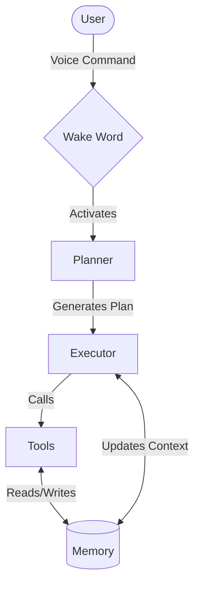

# Alchemist OS

Alchemist OS is a futuristic, highly autonomous AI operating system designed to serve as a continuous background companion and digital operator.

## Features

* **Voice Assistant:** Always-on voice interface with advanced text-to-speech synthesis.
* **Wake Word Detection:** Seamlessly initiate interactions using the "Hey Alchemist" wake word.
* **Memory System:** Persistent memory architecture tracking short-term context, long-term semantic knowledge, and project states.
* **Project Management:** Organize, track, and execute multi-step active projects autonomously.
* **Browser Automation:** Fully autonomous web navigation, information retrieval, and complex form interactions.
* **Vision Agent:** Periodically captures and processes visual context from your active environment.
* **Screenshot Analysis:** Structurally analyzes UI elements, applications, and text (OCR) using state-of-the-art vision models.
* **Operator Mode:** Directly interfaces with your operating system with precise mouse movements and keyboard input.
* **Autonomous Task Planning:** Dynamically constructs execution plans and delegates sub-tasks to a robust internal tool registry.
* **Self-Improvement System:** Automatically reflects on task outcomes to iteratively enhance future performance.

## Architecture

The Alchemist OS architecture handles complex reasoning through a streamlined flow, translating user intent into concrete actions:

1. **User:** Provides an initial prompt or command (voice or text).
2. **Wake Word:** Continuously listens locally for the activation phrase.
3. **Planner:** Deconstructs the user's goal into a logical sequence of actionable steps.
4. **Executor:** Processes the plan, handling error recovery, retries, and state management.
5. **Tools:** Interacts directly with the environment (Browser, OS, File System) to fulfill the current step.
6. **Memory:** Persists outcomes, reflections, and context for future retrieval and continuous learning.



## Technology Stack

**Backend:**
* Python
* Groq
* Playwright
* PyAutoGUI
* SQLite
* ElevenLabs

**Frontend:**
* Next.js
* React
* TypeScript
* Three.js

## Installation

### Prerequisites
- Python 3.10+
- Node.js 18+
- [Groq API Key](https://console.groq.com/)
- [ElevenLabs API Key](https://elevenlabs.io/) (for Voice Assistant)

### Step-by-Step Setup

1. **Clone the repository:**
   ```bash
   git clone <repository-url>
   cd AlchemistAI
   ```

2. **Backend Setup:**
   ```bash
   # Create and activate virtual environment (Windows)
   python -m venv venv
   .\venv\Scripts\activate
   
   # Install dependencies
   pip install -r requirements.txt
   
   # Configure environment variables
   # Copy .env.example to .env and fill in your API keys
   cp .env.example .env
   ```

3. **Frontend Setup:**
   ```bash
   cd frontend
   npm install
   ```

## Usage

1. **Start the backend server:**
   ```bash
   # From the root directory with venv activated
   python backend/main.py
   ```

2. **Launch the frontend interface:**
   ```bash
   # In a new terminal, from the frontend directory
   cd frontend
   npm run dev
   ```

**Example Commands:**
* *"Hey Alchemist, summarize the latest tech news on Hacker News."*
* *"Hey Alchemist, what application is currently open on my screen?"*
* *"Hey Alchemist, create a new React component for a navigation bar and save it in my current project."*

## Documentation

For more detailed information, please refer to our comprehensive documentation:
- [Architecture & Design](docs/architecture.md)
- [Detailed Installation Guide](docs/installation.md)
- [Deployment Guide](docs/deployment.md)
- [Troubleshooting](docs/troubleshooting.md)
- [Phase 1 Verification](docs/phase1_verification.md)

## Project Structure

```text
AlchemistAI/
├── backend/                  # Python Agent Core
│   ├── core/                 # Configuration and system utilities
│   ├── executor/             # Agent execution engine
│   ├── memory/               # SQLite database management
│   ├── planner/              # Autonomous task orchestration
│   ├── tools/                # Action tool registry (Browser, File, Operator)
│   ├── vision/               # Screenshot capture and vision analysis
│   ├── voice/                # Wake word detection and TTS
│   └── main.py               # Main application entry point
├── docs/                     # System documentation and reports
├── frontend/                 # Next.js Holographic Interface
│   ├── public/               # Static assets and 3D models
│   └── src/                  # React components and styling
├── scripts/                  # Utility and startup scripts
└── tests/                    # Comprehensive testing suite
    ├── stability/            # Long-running endurance tests
    ├── stress/               # High-load system testing
    └── unit/                 # Core component unit tests
```

## Stability Testing

Alchemist OS is designed for high reliability and 24/7 continuous operation. The system has successfully completed rigorous **1-hour burn-in testing**, proving the endurance and stability of its memory, vision, planner, and browser subsystems without risking systemic failure.

To manually verify system health and run the background test script:
```bash
python tests/stability/stability_test.py
```
This automated suite outputs a live `stability_report.md` tracking heap allocations, CPU overhead, and crash counts.

For details on our Release Candidate 1 validation, see the [RC1 Report](ALCHEMIST_RC1_REPORT.md) and [RC1 Checklist](RC1_CHECKLIST.md).

## Roadmap

* **RC1 (Release Candidate 1):** 
  * [x] Core system stability.
  * [x] Integration of basic voice and vision capabilities.
  * [x] Foundational operator tools.
* **v1.0:** 
  * Full continuous background companion mode.
  * Enhanced multi-step reasoning capabilities.
  * Robust memory system and self-reflection workflows.
* **Future Features:**
  * Multi-agent collaboration frameworks.
  * Advanced local LLM support for complete offline privacy.
  * Deep semantic analysis for nuanced long-term context retention.
  * Cross-device synchronization and control.

## License

Distributed under the MIT License. See `LICENSE` for more information.
